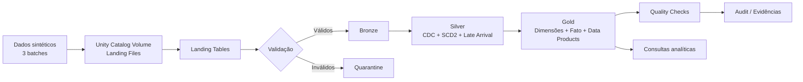

# Case Técnico — Senior Data Engineer | Data Product Financeiro

Projeto de engenharia de dados desenvolvido em **Databricks Free Edition** para simular e processar dados financeiros por meio de uma arquitetura **Medallion (Landing, Bronze, Silver e Gold)**.

A solução demonstra ingestão em lote, validação e quarentena, CDC, tratamento de dados atrasados, evolução de schema, SCD Type 2, modelagem dimensional, produtos de dados analíticos e controles de qualidade.

## Visão geral

O pipeline processa seis entidades sintéticas:

- clientes;
- contas;
- cartões;
- transações;
- eventos de risco;
- estornos.

São gerados três lotes para representar uma carga inicial, atualizações CDC e cenários de late arrival, duplicidade, registros inválidos e schema evolution.

## Arquitetura Geral

A figura abaixo apresenta uma visão consolidada da arquitetura implementada, destacando as camadas do Lakehouse, os principais componentes da plataforma e o fluxo completo de processamento dos dados.


A visão acima resume toda a solução. O diagrama a seguir detalha o fluxo lógico de processamento implementado ao longo do pipeline.

## Arquitetura Lógica



Detalhes: [`docs/architecture.md`](docs/architecture.md).

## Tecnologias

- Databricks Free Edition;
- Apache Spark / PySpark;
- Delta Lake;
- Unity Catalog;
- Python;
- SQL;
- Git e GitHub.

## Estrutura do repositório

```text
case-senior-data-product/
├── config/
│   └── data_generation.yaml
├── data/
│   └── landing/.gitkeep
├── docs/
│   ├── architecture.md
│   ├── data_contracts.md
│   ├── decisions.md
│   └── images/
├── evidence/
│   └── README.md
├── notebooks/
│   ├── 00_setup_environment.py
│   ├── 01_generate_sample_data.py
│   ├── 02_load_landing.py
│   ├── 03_validate_landing.py
│   ├── 04_bronze.py
│   ├── 05_silver.py
│   ├── 06_gold.py
│   ├── 07_quality_checks.py
│   └── 08_demo_queries.py
├── scripts/
│   ├── generate_sample_data.py
│   ├── generate_batch_002.py
│   ├── generate_batch_003.py
│   └── validate_landing_data.py
├── tests/
├── .gitignore
├── pyproject.toml
├── requirements.txt
└── README.md
```

## Notebooks e ordem de execução

| Ordem | Notebook | Responsabilidade |
|---:|---|---|
| 00 | `00_setup_environment.py` | Criação dos schemas e estruturas de auditoria |
| 01 | `01_generate_sample_data.py` | Geração dos dados sintéticos e publicação dos batches no Volume |
| 02 | `02_load_landing.py` | Leitura dos arquivos e criação das tabelas Landing |
| 03 | `03_validate_landing.py` | Validação, separação de válidos e envio de inválidos à quarentena |
| 04 | `04_bronze.py` | Persistência padronizada e rastreável na Bronze |
| 05 | `05_silver.py` | CDC, deduplicação, SCD2, late arrival e integridade referencial |
| 06 | `06_gold.py` | Dimensões, tabela fato e produtos de dados |
| 07 | `07_quality_checks.py` | Regras de qualidade, reconciliação e persistência dos resultados |
| 08 | `08_demo_queries.py` | Demonstrações analíticas e validação funcional da solução |

Os arquivos foram exportados do Databricks no formato **Source**, por isso preservam os marcadores `# COMMAND ----------` e `# MAGIC`.

## Camadas

### Landing

Recebe os arquivos CSV dos três batches em um Unity Catalog Volume e os disponibiliza em tabelas com metadados técnicos de origem.

### Bronze

Mantém os dados válidos de forma próxima à origem, acrescentando rastreabilidade e timestamp de processamento.

### Silver

Aplica regras de negócio e qualidade:

- normalização de tipos e campos;
- deduplicação determinística;
- CDC com operações de insert, update e delete;
- SCD Type 2 para clientes, contas e cartões;
- indicadores `registro_atual`, `registro_excluido` e `versao_registro`;
- tratamento de eventos fora de ordem;
- validações de referência e quarentena complementar.

### Gold

## Modelo Dimensional

A camada Gold implementa um modelo estrela composto por dimensões conformadas, uma tabela fato de transações e três Data Products derivados para consumo analítico e preparação de features para Machine Learning.


Entrega um modelo dimensional e produtos de dados voltados ao consumo analítico.

**Dimensões**

- `gold_dim_cliente`;
- `gold_dim_conta`;
- `gold_dim_cartao`;
- `gold_dim_estabelecimento`.

**Fato**

- `gold_fato_transacao`.

**Data Products**

- `gold_cliente_mes`;
- `gold_indicadores_risco`;
- `gold_features_cliente`.

## Resultados da execução de referência

| Objeto | Registros | Colunas |
|---|---:|---:|
| `gold_dim_cliente` | 1.016 | 10 |
| `gold_dim_conta` | 1.217 | 12 |
| `gold_dim_cartao` | 913 | 13 |
| `gold_dim_estabelecimento` | 300 | 7 |
| `gold_fato_transacao` | 17.300 | 27 |
| `gold_cliente_mes` | 4.509 | 16 |
| `gold_indicadores_risco` | 711 | 13 |
| `gold_features_cliente` | 1.016 | 21 |

A reconciliação registrou **17.300 transações distintas na Silver e 17.300 na Gold**, sem diferença.

Os Quality Checks produziram:

- **30 PASS**;
- **3 WARNING**;
- **0 FAIL**.

Os warnings de integridade são esperados porque as dimensões Gold expõem apenas registros correntes e não excluídos, enquanto a Silver preserva o histórico SCD2 completo.

## Execução no Databricks Free Edition

1. Importe a pasta `notebooks/` para o Workspace como arquivos Source.
2. Abra `00_setup_environment` e execute as células.
3. Execute os notebooks sequencialmente de `01` a `08`.
4. Confirme que o catálogo atual permite criação de schemas e Volumes.
5. Consulte os resultados nos schemas `case_gold`, `case_quarantine` e `case_audit`.

Schemas utilizados:

```text
<catalogo_atual>.case_landing
<catalogo_atual>.case_bronze
<catalogo_atual>.case_silver
<catalogo_atual>.case_gold
<catalogo_atual>.case_quarantine
<catalogo_atual>.case_audit
```

No ambiente de desenvolvimento, o catálogo utilizado foi `workspace`.

## Execução local dos utilitários

Os scripts locais são opcionais e servem para gerar/validar arquivos sintéticos fora do Databricks.

```bash
python -m venv .venv
```

Windows:

```powershell
.venv\Scripts\activate
pip install -r requirements.txt
python scripts/generate_sample_data.py
```

Testes de estrutura e configuração:

```bash
pytest
```

## Decisões e contratos

- [Decisões arquiteturais e trade-offs](docs/decisions.md)
- [Contratos de dados](docs/data_contracts.md)
- [Arquitetura detalhada](docs/architecture.md)
- [Evidências de execução](evidence/README.md)

## Limitações e melhorias futuras

- orquestração por Databricks Workflows/Jobs;
- testes automatizados Spark em cluster dedicado;
- CI/CD com Databricks Asset Bundles;
- observabilidade centralizada e alertas;
- otimização física com particionamento, `OPTIMIZE` e `ZORDER`, conforme volume real;
- catálogo de dados com ownership, classificação e políticas de acesso mais granulares;
- parametrização completa por ambiente.

## Autor

**Anderson de Alencar Pereira**  
Senior Data Engineer | Analytics Engineering | Business Intelligence


## Melhorias Futuras

- Orquestração com Databricks Workflows.
- Testes de qualidade com Great Expectations.
- Deploy automatizado via CI/CD.
- Observabilidade com métricas e alertas.
- Catálogo de dados e linhagem.
