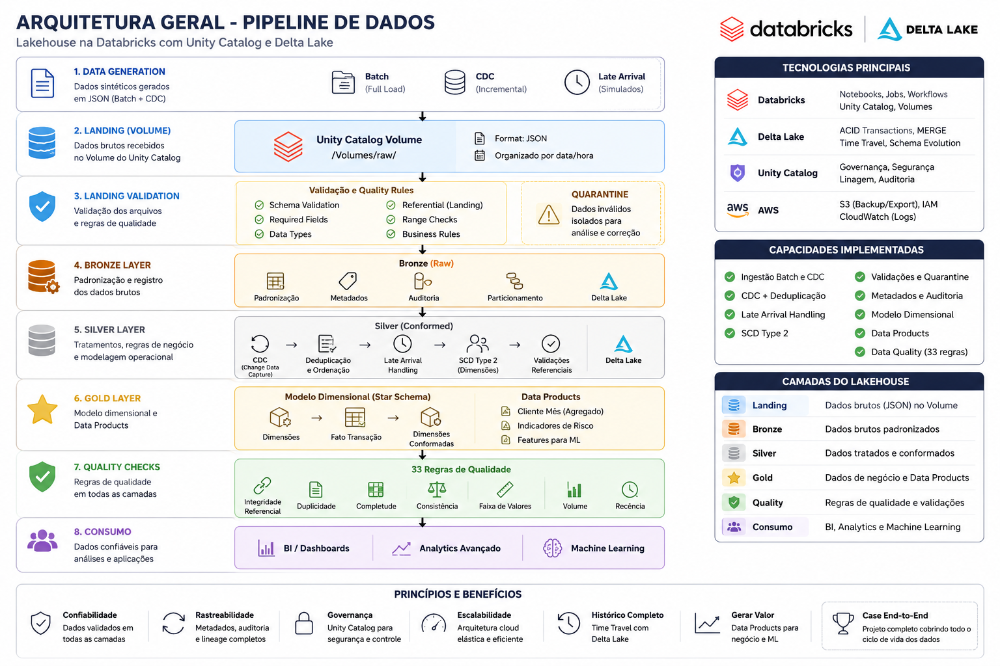
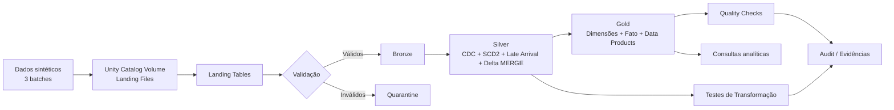
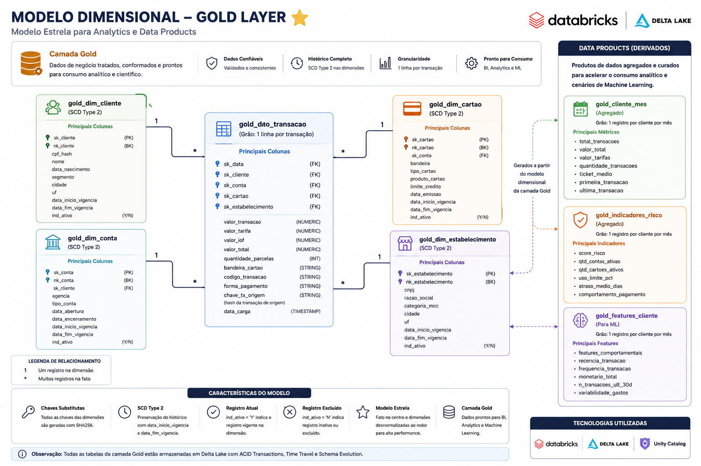
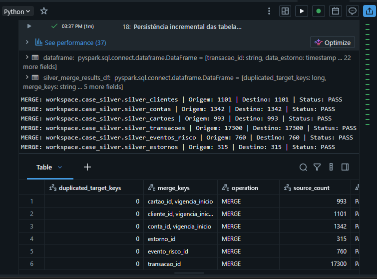
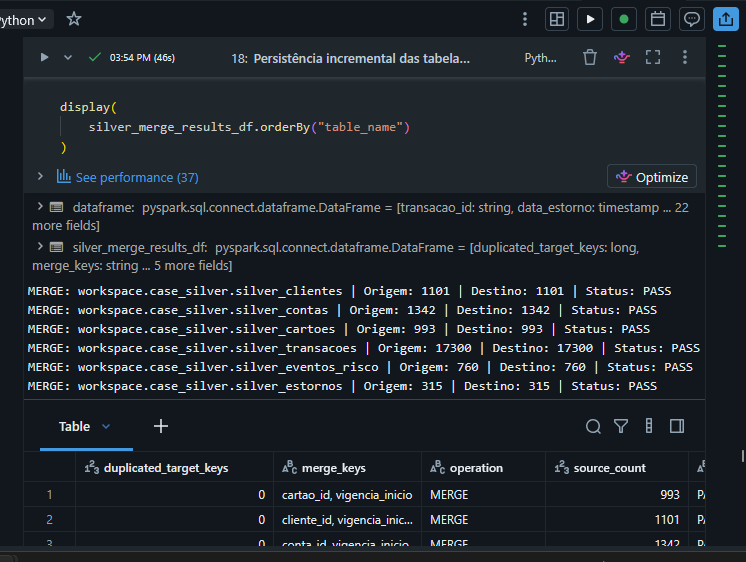
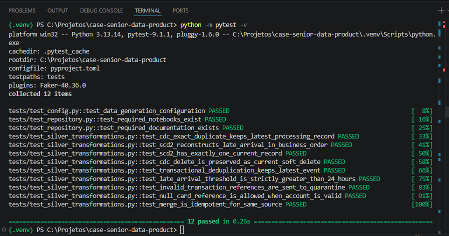
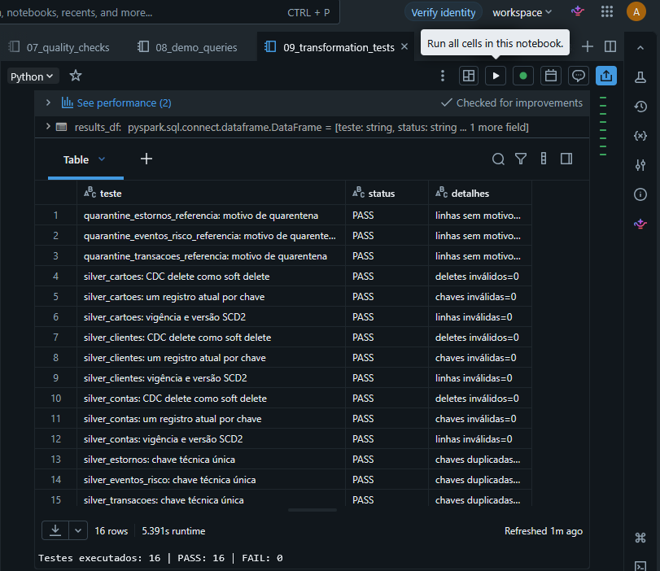

# Case Técnico — Senior Data Engineer | Data Product Financeiro

Projeto de engenharia de dados desenvolvido em **Databricks Free Edition** para simular e processar dados financeiros por meio de uma arquitetura **Medallion (Landing, Bronze, Silver e Gold)**.

A solução demonstra ingestão em lote, validação e quarentena, CDC, tratamento de dados atrasados, evolução de schema, SCD Type 2, persistência incremental com Delta MERGE, modelagem dimensional, produtos de dados analíticos, testes automatizados e controles de qualidade.

## Destaques da solução

- arquitetura Lakehouse com camadas Landing, Bronze, Silver e Gold;
- persistência incremental da camada Silver com `Delta MERGE`;
- processamento idempotente para reexecuções seguras;
- CDC com operações de insert, update e delete;
- SCD Type 2 para preservação do histórico;
- tratamento de late arrival e eventos fora de ordem;
- schema evolution controlada;
- quarentena de registros inválidos sem interrupção do lote;
- modelo dimensional em estrela;
- Data Products para análise e preparação de features;
- testes automatizados locais e no Databricks;
- evidências de execução e validação.

## Visão geral

O pipeline processa seis entidades sintéticas:

- clientes;
- contas;
- cartões;
- transações;
- eventos de risco;
- estornos.

São gerados três lotes para representar:

- carga inicial;
- atualizações CDC;
- exclusões lógicas;
- late arrival;
- duplicidades;
- registros inválidos;
- evolução de schema.

## Arquitetura Geral

A figura abaixo apresenta uma visão consolidada da arquitetura implementada, destacando as camadas do Lakehouse, os principais componentes da plataforma e o fluxo completo de processamento dos dados.



A visão acima resume toda a solução. O diagrama a seguir detalha o fluxo lógico implementado ao longo do pipeline.

## Arquitetura Lógica



Detalhes: [`docs/architecture.md`](docs/architecture.md).

## Tecnologias

- Databricks Free Edition;
- Databricks Serverless;
- Apache Spark / PySpark;
- Delta Lake;
- Unity Catalog;
- Python;
- SQL;
- pytest;
- Git e GitHub.

## Estrutura do repositório

```text
case-senior-data-product/
├── config/
│   └── data_generation.yaml
├── data/
│   └── landing/.gitkeep
├── docs/
│   ├── architecture.md
│   ├── data_contracts.md
│   ├── decisions.md
│   └── images/
├── evidence/
│   ├── merge_incremental/
│   │   ├── silver_merge_primeira_execucao.png
│   │   └── silver_merge_idempotencia_segunda_execucao.png
│   ├── tests/
│   │   ├── pytest_12_passed.png
│   │   └── databricks_transformation_tests.png
│   └── README.md
├── notebooks/
│   ├── 00_setup_environment.py
│   ├── 01_generate_sample_data.py
│   ├── 02_load_landing.py
│   ├── 03_validate_landing.py
│   ├── 04_bronze.py
│   ├── 05_silver.py
│   ├── 06_gold.py
│   ├── 07_quality_checks.py
│   ├── 08_demo_queries.py
│   └── 09_transformation_tests.py
├── scripts/
│   ├── generate_sample_data.py
│   ├── generate_batch_002.py
│   ├── generate_batch_003.py
│   └── validate_landing_data.py
├── src/
│   ├── __init__.py
│   └── silver_business_rules.py
├── tests/
│   ├── conftest.py
│   └── test_silver_transformations.py
├── .gitignore
├── pyproject.toml
├── requirements.txt
└── README.md
```

## Notebooks e ordem de execução

| Ordem | Notebook | Responsabilidade |
|---:|---|---|
| 00 | `00_setup_environment.py` | Criação dos schemas e estruturas de auditoria |
| 01 | `01_generate_sample_data.py` | Geração dos dados sintéticos e publicação dos batches no Volume |
| 02 | `02_load_landing.py` | Leitura dos arquivos e criação das tabelas Landing |
| 03 | `03_validate_landing.py` | Validação, separação de válidos e envio de inválidos à quarentena |
| 04 | `04_bronze.py` | Persistência padronizada e rastreável na Bronze |
| 05 | `05_silver.py` | CDC, deduplicação, SCD2, late arrival, integridade referencial e persistência incremental com Delta MERGE |
| 06 | `06_gold.py` | Dimensões, tabela fato e produtos de dados |
| 07 | `07_quality_checks.py` | Regras de qualidade, reconciliação e persistência dos resultados |
| 08 | `08_demo_queries.py` | Demonstrações analíticas e validação funcional da solução |
| 09 | `09_transformation_tests.py` | Validação automatizada das regras de negócio e consistência da camada Silver |

Os arquivos foram exportados do Databricks no formato **Source**, por isso preservam os marcadores `# COMMAND ----------` e `# MAGIC`.

## Camadas

### Landing

Recebe os arquivos CSV dos três batches em um Unity Catalog Volume e os disponibiliza em tabelas com metadados técnicos de origem.

### Bronze

Mantém os dados válidos de forma próxima à origem, acrescentando rastreabilidade, identificação do lote e timestamp de processamento.

### Silver

Aplica regras de negócio e qualidade:

- normalização de tipos e campos;
- deduplicação determinística;
- CDC com operações de insert, update e delete;
- SCD Type 2 para clientes, contas e cartões;
- indicadores `registro_atual`, `registro_excluido` e `versao_registro`;
- tratamento de eventos fora de ordem;
- tratamento de late arrival;
- validações de referência e quarentena complementar;
- persistência incremental com `Delta MERGE`;
- reprocessamento idempotente.

### Gold

Entrega dados prontos para consumo analítico por meio de dimensões conformadas, tabela fato e Data Products derivados.

## Estratégia incremental com Delta MERGE

A camada Silver utiliza `Delta MERGE` para persistir os resultados de forma incremental.

A estratégia substitui a abordagem baseada em overwrite e permite:

- inserir novos registros;
- atualizar registros existentes;
- preservar o histórico SCD Type 2;
- tratar exclusões lógicas;
- evitar duplicação de chaves técnicas;
- reexecutar o mesmo processamento sem alterar indevidamente o resultado;
- aproximar a implementação de um cenário produtivo.

A idempotência foi validada por meio de duas execuções consecutivas do notebook Silver. A segunda execução manteve as mesmas quantidades de registros e não gerou duplicidades nas chaves de destino.

### Resultado de referência do MERGE

| Tabela Silver | Registros |
|---|---:|
| `silver_clientes` | 1.101 |
| `silver_contas` | 1.342 |
| `silver_cartoes` | 993 |
| `silver_transacoes` | 17.300 |
| `silver_eventos_risco` | 760 |
| `silver_estornos` | 315 |

Em todas as tabelas:

- operação registrada: `MERGE`;
- status: `PASS`;
- chaves duplicadas no destino: `0`.

## Modelo Dimensional

A camada Gold implementa um modelo estrela composto por dimensões conformadas, uma tabela fato de transações e três Data Products derivados para consumo analítico e preparação de features para Machine Learning.



### Dimensões

- `gold_dim_cliente`;
- `gold_dim_conta`;
- `gold_dim_cartao`;
- `gold_dim_estabelecimento`.

### Fato

- `gold_fato_transacao`.

### Data Products

- `gold_cliente_mes`;
- `gold_indicadores_risco`;
- `gold_features_cliente`.

## Resultados da execução de referência

| Objeto | Registros | Colunas |
|---|---:|---:|
| `gold_dim_cliente` | 1.016 | 10 |
| `gold_dim_conta` | 1.217 | 12 |
| `gold_dim_cartao` | 913 | 13 |
| `gold_dim_estabelecimento` | 300 | 7 |
| `gold_fato_transacao` | 17.300 | 27 |
| `gold_cliente_mes` | 4.509 | 16 |
| `gold_indicadores_risco` | 711 | 13 |
| `gold_features_cliente` | 1.016 | 21 |

A reconciliação registrou **17.300 transações distintas na Silver e 17.300 na Gold**, sem diferença.

Os Quality Checks produziram:

- **30 PASS**;
- **3 WARNING**;
- **0 FAIL**.

Os warnings de integridade são esperados porque as dimensões Gold expõem apenas registros correntes e não excluídos, enquanto a Silver preserva o histórico SCD Type 2 completo.

## Testes automatizados

O projeto possui duas estratégias complementares de testes:

1. testes unitários locais das regras de transformação;
2. testes de integração e consistência executados diretamente no Databricks.

### Testes locais com pytest

Os testes locais validam funções de negócio isoladas do ambiente Databricks.

Cobertura principal:

- resolução de duplicidades CDC;
- reconstrução de histórico SCD Type 2;
- garantia de somente um registro corrente;
- tratamento de delete CDC;
- deduplicação transacional;
- late arrival;
- integridade referencial;
- regras de quarentena;
- cartão nulo permitido;
- idempotência da estratégia de MERGE.

Execução:

```bash
python -m pytest -v
```

Resultado de referência:

```text
12 passed
```

### Testes no Databricks

O notebook `09_transformation_tests.py` valida os resultados persistidos nas tabelas Silver.

Entre as regras verificadas estão:

- motivos de quarentena;
- delete CDC;
- existência de apenas um registro corrente por chave;
- versionamento SCD Type 2;
- unicidade de chaves técnicas;
- integridade dos dados processados;
- consistência das transformações.

Resultado de referência:

```text
Testes executados: 16
PASS: 16
FAIL: 0
```

## Evidências

### Delta MERGE e idempotência

Primeira execução:



Segunda execução e validação de idempotência:



### Testes locais



### Testes no Databricks



## Execução no Databricks Free Edition

1. Importe a pasta `notebooks/` para o Workspace como arquivos Source.
2. Abra `00_setup_environment.py` e execute todas as células.
3. Execute sequencialmente os notebooks de `01_generate_sample_data.py` até `08_demo_queries.py`.
4. Execute `09_transformation_tests.py` para validar as regras de negócio e a consistência das tabelas Silver.
5. Confirme que o catálogo atual permite a criação de schemas e Volumes.
6. Consulte os resultados nos schemas `case_silver`, `case_gold`, `case_quarantine` e `case_audit`.

Schemas utilizados:

```text
<catalogo_atual>.case_landing
<catalogo_atual>.case_bronze
<catalogo_atual>.case_silver
<catalogo_atual>.case_gold
<catalogo_atual>.case_quarantine
<catalogo_atual>.case_audit
```

No ambiente de desenvolvimento, o catálogo utilizado foi `workspace`.

### Compatibilidade com Serverless

A implementação foi adaptada às limitações do Databricks Free Edition Serverless.

Por esse motivo, a solução não depende de:

- alteração dinâmica da configuração `spark.databricks.delta.schema.autoMerge.enabled`;
- persistência manual de DataFrames com `persist()` ou `unpersist()`.

O schema é tratado explicitamente no fluxo, e o processamento utiliza operações compatíveis com o ambiente Serverless.

## Execução local

Os scripts locais são opcionais e servem para gerar e validar arquivos sintéticos fora do Databricks, além de executar os testes unitários.

### Criar o ambiente virtual

```bash
python -m venv .venv
```

### Ativar no Windows

```powershell
.venv\Scripts\activate
```

### Instalar as dependências

```powershell
pip install -r requirements.txt
```

### Gerar dados sintéticos

```powershell
python scripts/generate_sample_data.py
```

### Executar os testes

```powershell
python -m pytest -v
```

## Decisões e contratos

- [Decisões arquiteturais e trade-offs](docs/decisions.md)
- [Contratos de dados](docs/data_contracts.md)
- [Arquitetura detalhada](docs/architecture.md)
- [Evidências de execução](evidence/README.md)

## Limitações e melhorias futuras

- orquestração por Databricks Workflows/Jobs;
- execução dos testes Spark em cluster dedicado;
- CI/CD com Databricks Asset Bundles;
- observabilidade centralizada e alertas;
- otimização física com particionamento, `OPTIMIZE` e `ZORDER`, conforme o volume real;
- catálogo de dados com ownership, classificação e políticas de acesso mais granulares;
- parametrização completa por ambiente;
- expansão dos testes com frameworks de qualidade de dados, como Great Expectations;
- monitoramento contínuo da taxa de quarentena e dos indicadores de qualidade.

## Autor

**Anderson de Alencar Pereira**  
Senior Data Engineer | Analytics Engineering | Business Intelligence
