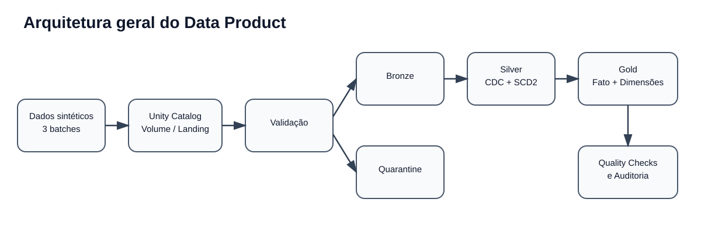
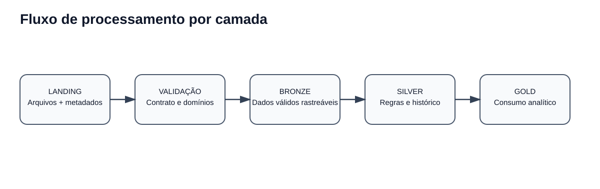
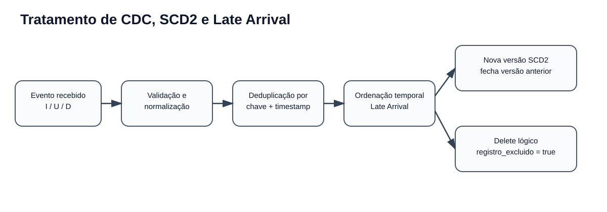
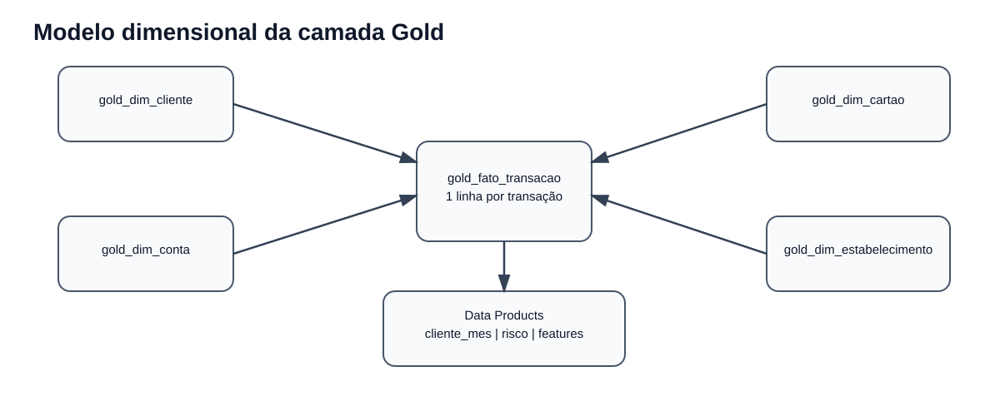

# Arquitetura da Solução

## Objetivo

Construir um Data Product financeiro rastreável e idempotente, capaz de processar alterações de cadastro, transações, risco e estornos, mantendo histórico e disponibilizando dados prontos para consumo analítico.

## Diagrama geral

## Fluxo por camada

### 1. Geração e origem

O notebook `01_generate_sample_data.py` cria três batches:

- `batch_001`: carga inicial;
- `batch_002`: inserts, updates e deletes;
- `batch_003`: late arrival, duplicidades, dados inválidos e colunas adicionais.

Os arquivos são gravados em um Unity Catalog Volume no schema `case_landing`.

### 2. Landing

A Landing representa o conteúdo recebido, preservando os dados de entrada e metadados técnicos:

- `_metadata.file_name`;
- `_metadata.file_path`;
- `_metadata.file_size`;
- `_metadata.file_modification_time`.

### 3. Validação e quarentena

As regras de contrato são aplicadas antes da promoção para Bronze. Registros inválidos são persistidos em `case_quarantine`, acompanhados do motivo da rejeição, sem interromper todo o pipeline.

### 4. Bronze

A Bronze consolida registros válidos com rastreabilidade de origem e processamento. Essa camada reduz o acoplamento entre arquivos e regras de negócio.

### 5. Silver

A Silver concentra as transformações principais:

- padronização e conversão de tipos;
- deduplicação por chave e ordenação de eventos;
- CDC para entidades cadastrais;
- SCD Type 2 para manutenção do histórico;
- tratamento de deletes lógicos;
- late arrival e eventos fora de ordem;
- validações de referência;
- evolução controlada de schema.

### 6. Gold

A Gold filtra as versões correntes e não excluídas das dimensões e cria chaves substitutas determinísticas com SHA-256.

A tabela `gold_fato_transacao` preserva a granularidade de uma linha por transação e agrega atributos de risco e estorno.

Os produtos derivados oferecem visões mensais, indicadores de risco e features por cliente.

## Modelo dimensional

### Dimensões

- **Cliente:** atributos atuais do cliente e chave substituta.
- **Conta:** conta atual vinculada ao cliente.
- **Cartão:** cartão atual vinculado à conta e ao cliente.
- **Estabelecimento:** atributos derivados das transações por estabelecimento.

### Fato

A `gold_fato_transacao` possui granularidade de **uma linha por `transacao_id`**, com referências às dimensões e métricas financeiras, temporais, de risco e estorno.

## Idempotência

As principais tabelas são reconstruídas ou sobrescritas de forma determinística a partir das camadas anteriores. A deduplicação e a escolha da versão vencedora usam chaves de negócio e timestamps/eventos de CDC. Assim, reprocessar os mesmos batches não deve aumentar indevidamente o número de registros.

## Segurança e governança

O Unity Catalog é utilizado para organizar os objetos por schema e centralizar a descoberta. Em um ambiente corporativo, a mesma organização permite aplicar permissões por camada, ownership, lineage e classificação de dados.

## Observabilidade

A solução registra resultados de Quality Checks e possui tabela de log de execução no schema de auditoria. Para produção, recomenda-se complementar com métricas de duração, volume processado, taxa de quarentena, freshness, alertas e integração com uma plataforma de observabilidade.

## Escalabilidade e performance

Para o volume sintético, a prioridade foi legibilidade e correção. Em produção, as otimizações devem ser guiadas pelo perfil de consulta e volume:

- particionamento por data em fatos volumosos;
- compactação de arquivos pequenos;
- `OPTIMIZE` e `ZORDER` para chaves seletivas;
- processamento incremental;
- broadcast apenas para dimensões pequenas;
- controle de skew e cardinalidade;
- manutenção e retenção de tabelas Delta.
